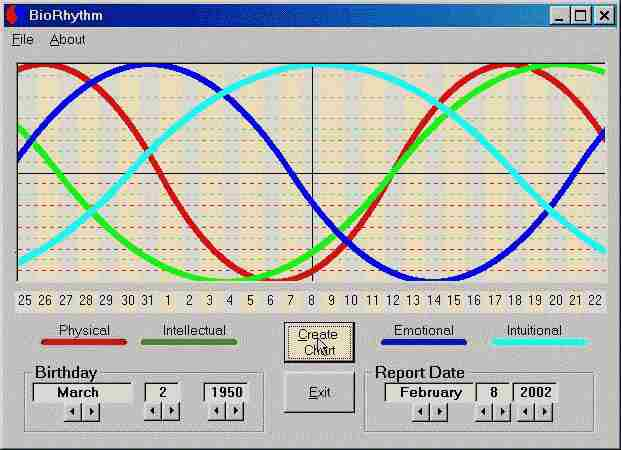



## BioRhythm

### Description

Biorhythm study and use is considered a "pseudo science" in the United State however it is widely accepted and utilized throughout Europe and much of the rest of the world.

Some of the things you might be interested in are: The use of the horizontal scroll bar as a up-down control. Using the API to get a temp file name. Getting a RTF formatted file from a Resource file and placing it in a Rich Textbox Control. Some fairly difficult date manipulations. Using the GetSettings and SaveSettings functions.
 
### More Info
 

             |
---                |---
**Submitted On**   |2002-02-20 00:21:36
**By**             |[Louis Boldt](https://github.com/Planet-Source-Code/PSCIndex/blob/master/ByAuthor/louis-boldt.md)
**Level**          |Intermediate
**User Rating**    |3.8 (15 globes from 4 users)
**Compatibility**  |VB 5\.0, VB 6\.0
**Category**       |[Miscellaneous](https://github.com/Planet-Source-Code/PSCIndex/blob/master/ByCategory/miscellaneous__1-1.md)
**World**          |[Visual Basic](https://github.com/Planet-Source-Code/PSCIndex/blob/master/ByWorld/visual-basic.md)
**Archive File**   |[BioRhythm563782202002\.zip](https://github.com/Planet-Source-Code/louis-boldt-biorhythm__1-31960/archive/master.zip)

